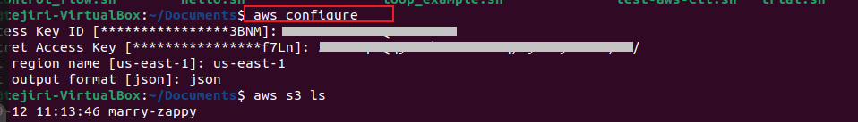
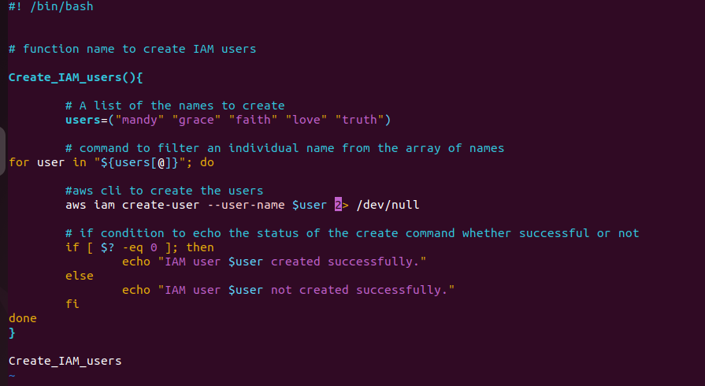
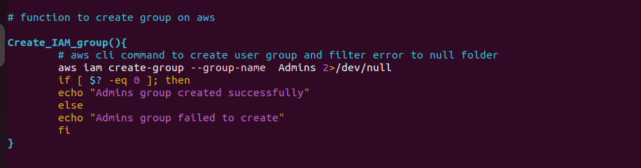
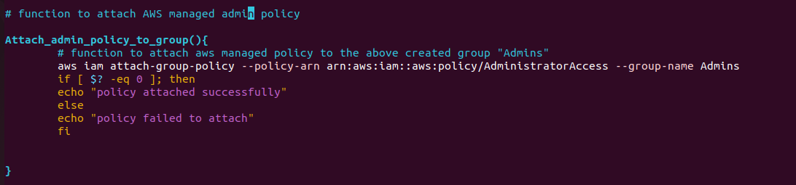
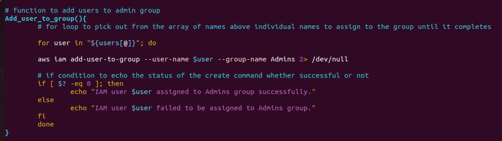
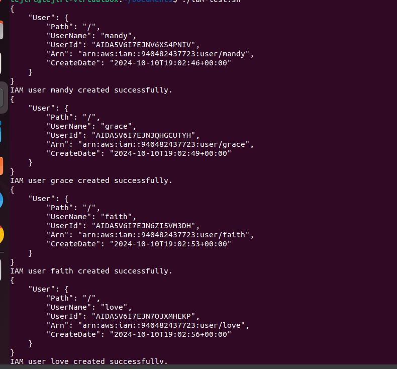

# Shell Script for AWS IAM Management

In this project I developed a shell script function to manage the AWS IAM management resources remotely from ubuntu terminal by configuring aws cli on the OS.

After successfully configuring the AWS CLI on the terminal with access key and secret key created on the console, we followed the following documented procedd to create AWS IAM users, an Admins group, attached policy to the user group and assigned the created users to the group from the terminal.

## Task-1: Creating AWS users
I created a shell script file named aws-iam-script.sh and granted execution permission.

I stated the script shebang command and then went ahead to create an array of users i want to create and assigned them to one variable called users in this format
users=("mandy" "grace" "faith" "love" "truth").

After wish I went ahead and named the function "Create_IAM_users".

I started the body of the function with the for loop which selects individual names from the array to present the name individually to the create command until the array is completed.

"for user in "${users[@]}"; do" 

After calling the create comand which we got from aws cli documentation we sent the standard error to the null folder to filter what is outputed for user friendliness.

"aws iam create-user --user-name $user 2> /dev/null"

I also created an if statement to echo the status of the create command if successful or not and with that we had our function simple, straight and completed.

"

if [ $? -eq 0 ]; then
                
                echo "IAM user $user created successfully."
        else
                echo "IAM user $user not created successfully."
        fi
"
where the $? represents a variable that is attached the status or outcome of a command, if therefore the status is equal to zero it means command ran successfully and if otherwise then it did not.

## Task-2: Creating user group:
This was straighforward because the project required creating just one user group which did not need loops, I simply ran the aws cli command for creating groups as seen in aws documentation and forward the standarderror output to the null file and also created an if condition to echo the status of the command.

## Task-3: Attaching AWS managed policy
This was also straight forward because we were attaching just one policy which was administartor access policy. I simply created the function name "Attaching_admins_policy_to_group", I got the command from the aws cli documentation and copied the "ARN" from the policy and attached the policy to the just created Admins group.

"
aws iam attach-group-policy --policy-arn arn:aws:iam::aws:policy/AdministratorAccess --group-name Admins
"

I created a condition to ouput the status of the command if successful or not for user friendliness.

## Task-4: Assign users to created group
Taking cue from the user creation I already have the names we created, therefore using that same array and pattern, i created a for loop to assign the users individually to the group until the array of names were completed.

"
for user in "${users[@]}"; do

	aws iam add-user-to-group --user-name $user --group-name Admins 2> /dev/null

	# if condition to echo the status of the create command whether successful or not
        if [ $? -eq 0 ]; then
                echo "IAM user $user assigned to Admins group successfully."
        else
                echo "IAM user $user failed to be assigned to Admins group."
        fi
	done
"
I forwarded the standard error outputs to the null folder and created a n if condition to echo the status of the command.

## Finally
I called all the functions created for this purpose as seen below.

## Result of Script: 
Script ran perfect as seen below

## Challenges Encountered
In trying to develop the code i started with complex conditions that seemed to make the script a bit too rough for someone who may not to modify, so i had to work out a simplier and straight forward script.
Also for the loop, it meant testing your code to see if it works which in turn created multiple users over and over again.

## Lesson learnt
In the course of the project i learnt other aws cli commands like get users to know the available user names already on our AWS account so as to avoid errors.

## Conclusion
Script was created simple and straight forward with user friendliness in mind and error handling responses.

find the script attached below

#! /bin/bash

# A shell script to create 5 IAM users and a group and attach a policy to this group and then add the users to the group

users=("mandy" "grace" "faith" "love" "truth")

Create_IAM_users(){

        # command to filter an individual name from the array of names
	for user in "${users[@]}"; do

        #aws cli to create the users and filter error output to the null folder
        aws iam create-user --user-name $user 2> /dev/null

        # if condition to echo the status of the create command whether successful or not
        if [ $? -eq 0 ]; then
                echo "IAM user $user created successfully."
        else
                echo "IAM user $user not created successfully."
        fi
	done
}

# function to create group on aws

Create_IAM_group(){
	# aws cli command to create user group and filter error to null folder
	aws iam create-group --group-name  Admins 2>/dev/null
	if [ $? -eq 0 ]; then 
	echo "Admins group created successfully"
	else
	echo "Admins group failed to create"
	fi
}

# function to attach AWS managed admin policy

Attach_admin_policy_to_group(){
	# function to attach aws managed policy to the above created group "Admins"
	aws iam attach-group-policy --policy-arn arn:aws:iam::aws:policy/AdministratorAccess --group-name Admins

    if[ $? -eq 0 ]; then
    echo "Policy attached successfully"
    else
    echo "Policy failed to attach"
}

# function to add users to admin group
Add_user_to_group(){
	# for loop to pick out from the array of names above individual names to assign to the group until it completes

	for user in "${users[@]}"; do

	aws iam add-user-to-group --user-name $user --group-name Admins 2> /dev/null

	# if condition to echo the status of the create command whether successful or not
        if [ $? -eq 0 ]; then
                echo "IAM user $user assigned to Admins group successfully."
        else
                echo "IAM user $user failed to be assigned to Admins group."
        fi
	done
}

Create_IAM_users
Create_IAM_group
Attach_admin_policy_to_group
Add_user_to_group